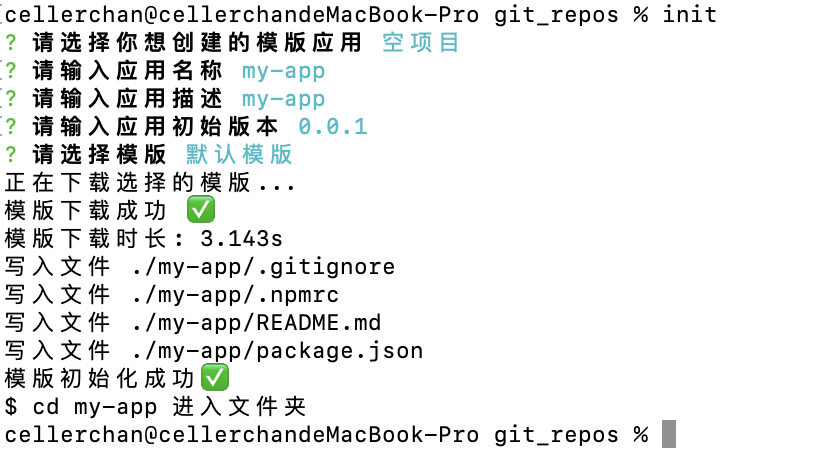

# @lexmin0412/init

这是一个前端脚手架。我的愿景是使用它来一键创建任何类型的前端项目。

## 全局安装（可选）

```bash
$ npm install @lexmin0412/init -g
```

## 用法

```bash
$ init

or

$ npx init
```

运行如上的命令后，依次会弹出如下的选项，按照提示键入即可。



如上图，在整个过程执行完毕之后，我们会看到刚刚创建的 `my-lib` 目录中创建了四个文件：

- .gitignore
- .npmrc
- README.md
- package.json

这是一个包含了基础结构的空项目，你可以基于它进行开发，不论是想要初始化一个工具类、一个单页应用，或一个 nodejs 服务，这些文件都是必要的。

## 已支持模版

- [x] 一个符合 npm 包标准结构的空项目
- [x] 基于 Rollup 的工具库
- [x] taro2.x 插件
- [x] taro3.x 插件
- [x] docsify 文档

## 更新日志

- [点我查看](https://github.com/lexmin0412/init/releases/tag/v0.0.5)
