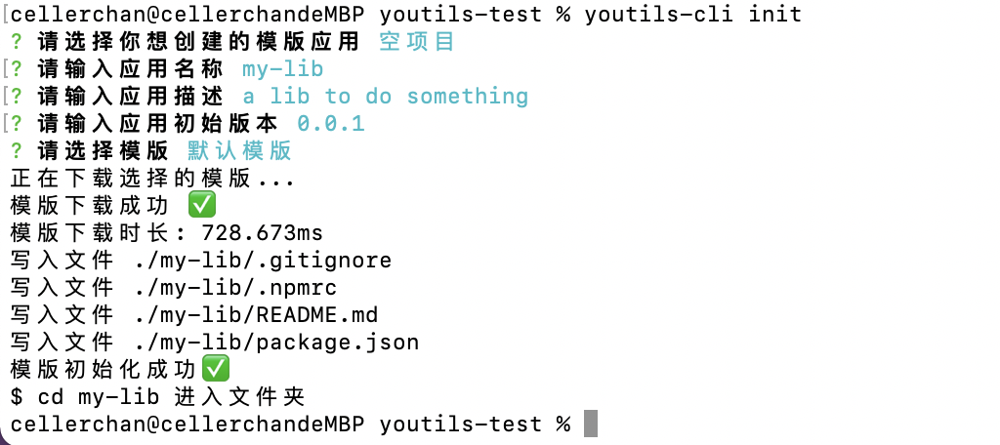

# youtils-cli

这是一个前端脚手架。我的愿景是使用它来一键创建任何类型的前端项目。

## 全局安装（可选）

```bash
$ npm install @youtils/cli -g
```

## 用法

```bash
$ youtils-cli

or

$ npx youtils-cli
```

运行如上的命令后，依次会弹出如下的选项，按照提示键入即可。



如上图，在整个过程执行完毕之后，我们会看到刚刚创建的 `my-lib` 目录中创建了四个文件：

- .gitignore
- .npmrc
- README.md
- package.json

这是一个包含了基础结构的空项目，你可以基于它进行开发，不论是想要初始化一个工具类、一个单页应用，或一个 nodejs 服务，这些文件都是必要的。

## 展望

当前我们暂时只支持初始化空项目，在短期内会支持如下模版：

- [ ] 基于 Rollup 的工具类
- [x] taro 插件
- [ ] taro 2.x/3.x 项目模版

当然在更遥远的未来，一切都是可能的。
